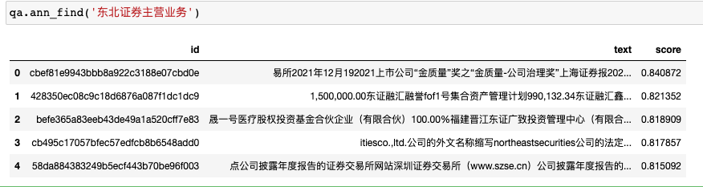

  

<h1 align = "center">🔥ChatLLM 基于知识库🔥</h1>

⛓️ 本项目实现原理如下图所示，过程包括加载文件 -> 读取文本 -> 文本分割 -> 文本向量化 -> 问句向量化 -> 在文本向量中匹配出与问句向量最相似的`top k`个 -> 匹配出的文本作为上下文和问题一起添加到`prompt`中 -> 提交给`LLM`生成回答。

# Install

```shell
pip install -U chatllm
```

# [Docs](https://jie-yuan.github.io/ChatLLM/)

# Usages

```python
from chatllm.applications import ChatBase

qa = ChatBase()
qa.load_llm4chat(model_name_or_path="THUDM/chatglm-6b")

for i, _ in qa(query='周杰伦是谁', knowledge_base='周杰伦是傻子'):
    pass
# 根据已知信息无法回答该问题，因为周杰伦是中国内地流行歌手、演员、音乐制作人、导演，
# 是具有一定的知名度和专业能力的人物，没有提供足够的信息无法判断他是傻子。
```

<details markdown="1">
  <summary>Click to ChatPDF</summary>

```python
from chatllm.applications.chatpdf import ChatPDF

qa = ChatPDF(encode_model='nghuyong/ernie-3.0-nano-zh')
qa.load_llm4chat(model_name_or_path="THUDM/chatglm-6b")
for i, _ in qa(query='东北证券主营业务'):
    pass
# 根据已知信息，东北证券的主营业务为证券业务。公司作为证券公司，主要从事证券经纪、证券投资咨询、与证券交易、
# 证券投资活动有关的财务顾问、证券承销与保荐、证券自营、融资融券、证券投资基金代销和代销金融产品待业务。
```



</details>


<details markdown="1">
  <summary>Click to 开发部署</summary>

- ChatGLM-6B 模型硬件需求

    | **量化等级**   | **最低 GPU 显存**（推理） | **最低 GPU 显存**（高效参数微调） |
    | -------------- | ------------------------- | --------------------------------- |
    | FP16（无量化） | 13 GB                     | 14 GB                             |
    | INT8           | 8 GB                     | 9 GB                             |
    | INT4           | 6 GB                      | 7 GB                              |

- Embedding 模型硬件需求

    本项目中默认选用的 Embedding 模型 [GanymedeNil/text2vec-large-chinese](https://huggingface.co/GanymedeNil/text2vec-large-chinese/tree/main) 约占用显存 3GB，也可修改为在 CPU 中运行。

## 开发部署

### 软件需求

本项目已在 Python 3.8 - 3.10，CUDA 11.7 环境下完成测试。已在 Windows、ARM 架构的 macOS、Linux 系统中完成测试。

### 从本地加载模型

请参考 [THUDM/ChatGLM-6B#从本地加载模型](https://github.com/THUDM/ChatGLM-6B#从本地加载模型)

### 1. 安装环境

参见 [安装指南](docs/INSTALL.md)。

</details>

<details markdown="1">
  <summary>Click to TODO</summary>

- [ ] 增加UI

- [x] 增加ChatPDF

- [x] 增加本地知识库组件

- [ ] 增加互联网搜索组件

- [ ] 增加知识图谱组件

- [ ] 增加微调模块

- [x] 增加流式输出

- [ ] 增加http接口

- [ ] 增加grpc接口

</details>


---

[ChatGLM-6B Mac 本地部署实操记录](https://www.yuque.com/arvinxx/llm/chatglm-6b-deployment-on-mac)

